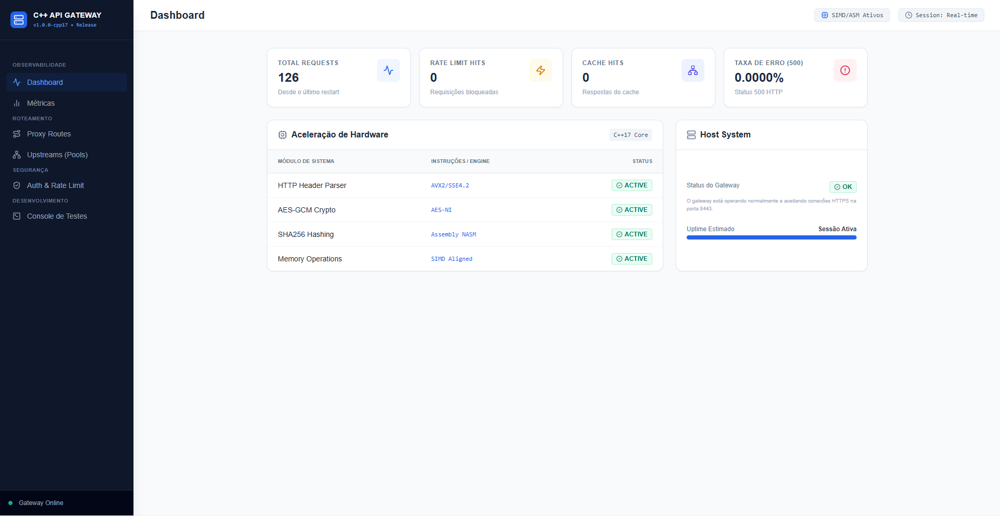
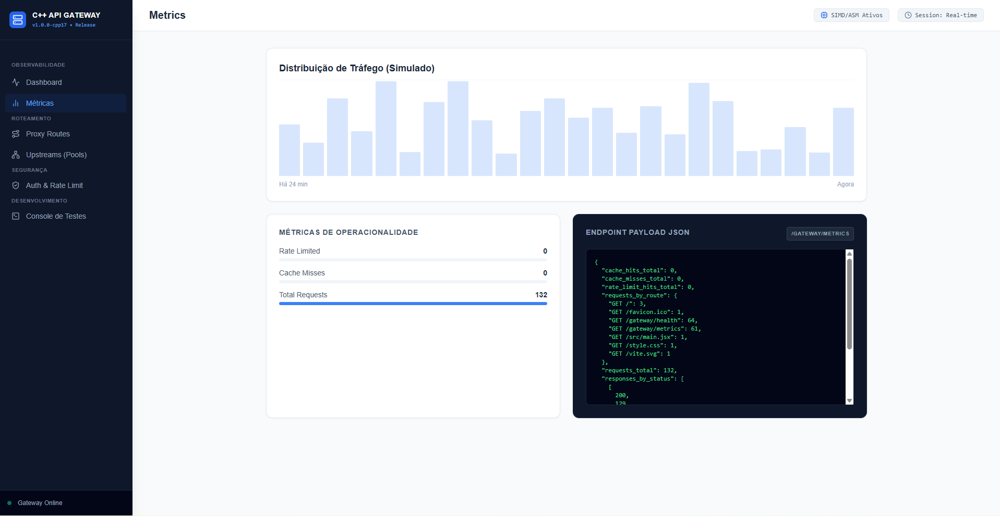
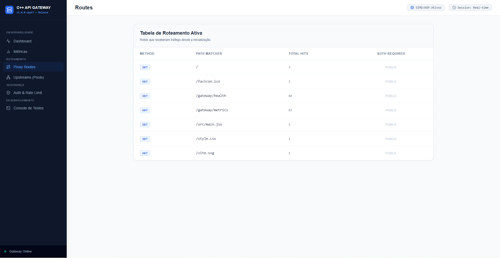
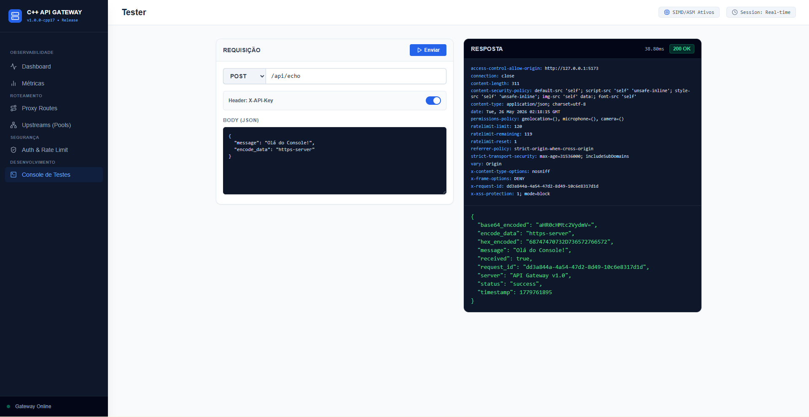

# API Gateway


**C++17 API Gateway with HTTPS, reverse proxying, load balancing, health checks, authentication, rate limiting, observability and SIMD/assembly acceleration.**

[](https://isocpp.org)
[](https://openssl.org)
[](https://cmake.org)
[](https://nasm.us)
[](LICENSE)

---

## Documentation

**[Main README](README.md)**  
**[Leia em Portugues](README_PT.md)**  
**[Architecture](docs/ARQUITETURA.md)**  
**[API Reference](docs/API.md)**

---

## Visual Preview

### Dashboard



### Metrics



### Proxy Routes



### Test Console



---

## What Is API Gateway?

API Gateway is the natural evolution of the project that previously existed as a high-performance HTTPS server. The first version focused on TLS, static file serving, JSON validation, benchmarks and low-level SIMD/assembly experiments. The current version keeps that systems-engineering foundation and adds real gateway capabilities: dynamic routing, reverse proxying, upstream pools, load balancing, active/passive health checks, rate limiting, authentication and operational endpoints.

The project now acts as an entry layer for internal services. It terminates HTTPS, parses requests, applies cross-cutting rules, forwards traffic to HTTP upstreams and exposes health and metrics signals. The original performance identity is still present in the crypto, parsing, validation, memory, compression and network-operation modules.

## Current Capabilities

- HTTPS server using OpenSSL.
- Dynamic HTTP router with exact routes, wildcard routes and path params such as `/users/:id`.
- Dedicated HTTP parser with configurable limits, case-insensitive headers, `Content-Length` body handling, path/query separation and query params.
- Middleware pipeline for cross-cutting behavior.
- Static files served from `client-web/`.
- HTTP cache support for static files with `ETag`, `Last-Modified`, `Cache-Control` and `304 Not Modified`.
- HTTP reverse proxy for internal services.
- Proxy headers: `X-Forwarded-For`, `X-Forwarded-Proto`, `X-Real-IP` and `Via`.
- Hop-by-hop header filtering before upstream forwarding.
- Upstream pools with `round_robin` and `least_connections` selection.
- Active HTTP health checks and passive failure tracking.
- Token Bucket rate limiting with `429 Too Many Requests`.
- `RateLimit-Limit`, `RateLimit-Remaining`, `RateLimit-Reset` and `Retry-After` headers.
- API key authentication, HMAC-SHA256 JWT validation, asymmetric JWT validation through public keys and route-level scope enforcement.
- Optional JSON logs for observability pipelines.
- Operational endpoints: `/gateway/health`, `/gateway/ready` and `/gateway/metrics`.
- RFC 6455 WebSocket echo support over TLS, including handshake, text/binary frames, ping/pong and close.
- SIMD/assembly modules for crypto, HTTP header-end scanning, validation, memory, compression and network operations.
- Benchmark endpoints and CMake benchmark binaries.

## Repository Layout

```text
client-web/                   static technical frontend
docs/                         official documentation
  ARQUITETURA.md              architecture and implementation details
  API.md                      endpoints, configuration and HTTP contracts
scripts/                      official build and benchmark scripts
service-api/service-cpp/      C++ runtime, tests and CMake project
service-api/service-assembly/ assembly acceleration routines
```

## Build

Requirements:

- C++17-capable compiler.
- CMake 3.16+.
- OpenSSL.
- NASM.
- Ninja is optional; the build script uses it automatically when available.

Main command:

```bash
./scripts/build.sh Release
```

On Windows, run it from Git Bash:

```bash
"C:/Program Files/Git/bin/bash.exe" ./scripts/build.sh Release
```

## Run

```bash
./build/api_gateway
# Windows/Git Bash: ./build/api_gateway.exe
```

Default configuration:

```text
service-api/service-cpp/config/config.json
```

An alternate configuration file can be selected with the `HTTPS_SERVER_CONFIG` environment variable.

## Quick Usage

Health check:

```bash
curl -k https://localhost:8443/gateway/health
```

Readiness check with upstream state:

```bash
curl -k https://localhost:8443/gateway/ready
```

Prometheus metrics:

```bash
curl -k https://localhost:8443/gateway/metrics
```

JSON metrics:

```bash
curl -k -H "Accept: application/json" https://localhost:8443/gateway/metrics
```

JSON echo with validation and network helper operations:

```bash
curl -k -X POST "https://localhost:8443/api/echo" \
  -H "Content-Type: application/json" \
  -d '{"message":"hello","encode_data":"gateway"}'
```

HTTP benchmarks:

```bash
curl -k https://localhost:8443/api/benchmark
```

## Gateway Configuration Example

```json
{
  "upstreams": {
    "users_service": {
      "targets": [
        "http://127.0.0.1:9001",
        "http://127.0.0.1:9002"
      ],
      "health_path": "/gateway/health",
      "health_interval_ms": 5000,
      "health_timeout_ms": 1000,
      "unhealthy_threshold": 2,
      "healthy_threshold": 1
    }
  },
  "proxy_routes": [
    {
      "method": "GET",
      "path": "/api/v1/users/*",
      "upstream": "users_service",
      "strip_prefix": "/api/v1/users",
      "load_balancer": "round_robin",
      "require_auth": true
    }
  ],
  "rate_limit": {
    "enabled": true,
    "capacity": 120,
    "refill_per_second": 20,
    "key": "ip"
  },
  "auth": {
    "enabled": true,
    "api_key_header": "X-API-Key",
    "api_keys": ["local-dev-key"],
    "jwt_hmac_secret": "local-secret"
  }
}
```

## Tests And Benchmarks

After building, test binaries are generated under `build/`:

```bash
./build/unit_test_http_parser
./build/unit_test_router
./build/unit_test_auth
./build/unit_test_aes
./build/unit_test_sha256
./build/unit_test_p256
./build/test_fast_memory
```

Benchmarks:

```bash
./scripts/run_benchmarks.sh
```

## Technical Notes

- The reverse proxy currently forwards to HTTP upstreams.
- The implemented WebSocket support is local echo support; it does not proxy WebSocket traffic to upstreams.
- JWT authentication supports HMAC-SHA256 and public-key asymmetric verification.
- HTTP/2, HTTP/3 and gRPC proxying are not part of the current runtime.

## License

Distributed under the MIT License. See [LICENSE](LICENSE).

---

## Author

**Thiago Di Faria**  
Email: [thiagodifaria@gmail.com](mailto:thiagodifaria@gmail.com)  
GitHub: [@thiagodifaria](https://github.com/thiagodifaria)

Built as a systems-engineering showcase in C++17, preserving the performance-focused roots of the original HTTPS server while evolving it into an API Gateway.
